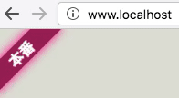

# Stylus for environments

もう私は事故らない!!



* 環境ごとにそれっぽいラベルを表示する Stylus 用 user css。
* 点滅させて目立たせることも可能。

## How to Use it?

1. Download Stylus
    * https://add0n.com/stylus.html
    * chrome, firefox, opera に対応。
1. Create a new style.
1. Copy `stylus-for-environments.user.css` and paste it to the editor.
1. Configure the style as your like.

## How to Configure?

It uses some css variables.

```css
@-moz-document domain("staging.example.com") {
  :root:before {
    --hue: 60;              /* hue of the label BG */
    --base-light: 25%;      /* Brightness of the label BG */
    --bright-light: 45%;    /* Brightness of the label BG (when it blinks) */
    --shadow-light: 50%;    /* Brightness of the label shadow */
    --duration: 1.0s;       /* Speed of blinking (set 0s to disable blinks) */
    content: "STAGING";     /* text in the label */
    font-weight: normal;    /* <- yes, literally */
  }
}
```

Beware of overwriting!!

[NG]
```css
/* the label blinks when you access staging.example.com */
/* which is NOT whay you expect. */

@-moz-document domain("staging.example.com") {
  :root:before {
    --duration: 0s;
    ...
  }
}

@-moz-document domain("example.com") {
  :root:before {
    --duration: 0.5s;
    ...
  }
}
```

[GOOD]
```css
/* overwrite root domain settings to apply subdomain settings */

@-moz-document domain("example.com") {
  :root:before {
    --duration: 0.5s;
    ...
  }
}

@-moz-document domain("staging.example.com") {
  :root:before {
    --duration: 0s;
    ...
  }
}
```

[Other example]
```css
@-moz-document domain("example.com") {
  :root:before {
    --duration: 0.5s;
    ...
  }
}

@-moz-document url-prefix("https://example.com:8080/") {
  :root:before {
    --duration: 1.0s;
    ...
  }
}
```
